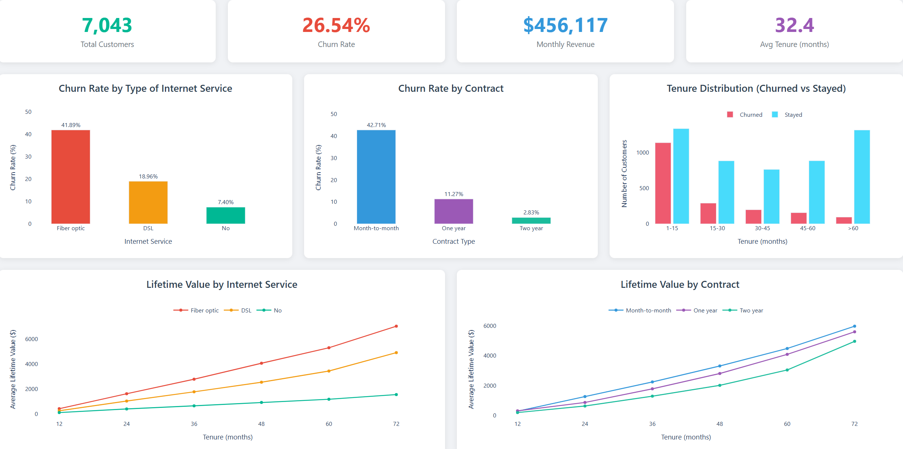

# Telco Customer Churn Analysis Dashboard

A comprehensive, interactive dashboard for analyzing customer churn patterns in a telecommunications company. Built with Python using Plotly Dash for real-time data visualization.


## 📊 Overview

This project provides a business analytics dashboard that helps identify key factors contributing to customer churn in the telecom industry. The dashboard visualizes critical metrics and patterns to support data-driven decision making for customer retention strategies.

### Dashboard Preview



## ✨ Features

### Key Performance Indicators (KPIs)
- **Total Customers** - Overall customer count in the dataset
- **Churn Rate** - Percentage of customers who have churned
- **Monthly Revenue** - Total monthly charges from all customers
- **Average Tenure** - Mean customer relationship duration

### Interactive Visualizations
- **Churn Rate by Internet Service** - Bar chart comparing churn across Fiber optic, DSL, and No internet service
- **Churn Rate by Contract Type** - Bar chart showing churn patterns for Month-to-month, One year, and Two year contracts
- **Tenure Distribution** - Grouped histogram comparing churned vs. retained customers across tenure bands
- **LTV by Internet Service** - Line chart tracking customer lifetime value trends by internet service type
- **LTV by Contract Type** - Line chart tracking customer lifetime value trends by contract type

## 🚀 Getting Started

### Prerequisites
- Python 3.10 or higher
- pip (Python package manager)

### Installation

1. **Clone the repository**
   ```bash
   git clone https://github.com/NhuGiap04/Telco_Churn_Analytics.git
   cd Telco_Churn_Analytics
   ```

2. **Create a virtual environment** (recommended)
   ```bash
   python -m venv .venv
   
   # Windows
   .venv\Scripts\activate
   
   # macOS/Linux
   source .venv/bin/activate
   ```

3. **Install dependencies**
   ```bash
   pip install -r requirements.txt
   ```

4. **Run the dashboard**
   ```bash
   python churn_dashboard.py
   ```

5. **Access the dashboard**
   
   Open your browser and navigate to: [http://127.0.0.1:8050](http://127.0.0.1:8050)

## 📁 Project Structure

```
Telco_Churn_Analytics/
├── churn_dashboard.py                      # Main Dash application
├── data/
│   └── Telco-Customer-Churn.csv            # Dataset
├── notebooks/
│   └── Telco_Churn_Analytics.ipynb         # Jupyter notebook for EDA
├── requirements.txt
└── README.md                               # Project documentation
```

## 📈 Dataset

The project uses the **Telco Customer Churn** dataset, which contains information about:

| Feature | Description |
|---------|-------------|
| `customerID` | Unique customer identifier |
| `gender` | Customer gender |
| `SeniorCitizen` | Whether customer is a senior citizen |
| `Partner` | Whether customer has a partner |
| `Dependents` | Whether customer has dependents |
| `tenure` | Number of months as a customer |
| `PhoneService` | Whether customer has phone service |
| `MultipleLines` | Whether customer has multiple lines |
| `InternetService` | Type of internet service (DSL, Fiber optic, No) |
| `Contract` | Contract type (Month-to-month, One year, Two year) |
| `MonthlyCharges` | Monthly charge amount |
| `TotalCharges` | Total charges over tenure |
| `Churn` | Whether customer churned (Yes/No) |

**Dataset Statistics:**
- **Total Records:** 7,043 customers
- **Features:** 21 columns
- **Target Variable:** Churn (Yes/No)

## 🛠️ Technologies Used

- **Python 3.12** - Programming language
- **Pandas** - Data manipulation and analysis
- **NumPy** - Numerical computing
- **Plotly** - Interactive visualization library
- **Dash** - Web application framework
- **Dash Bootstrap Components** - UI components and styling

## 📊 Key Insights

Based on the dashboard analysis:

1. **Contract Type Impact** - Month-to-month contracts show significantly higher churn rates compared to longer-term contracts
2. **Internet Service** - Fiber optic customers exhibit higher churn rates than DSL or no internet customers
3. **Tenure Patterns** - Customers with shorter tenure (0-15 months) are more likely to churn
4. **LTV Trends** - Customer lifetime value increases substantially with longer tenure across all segments

